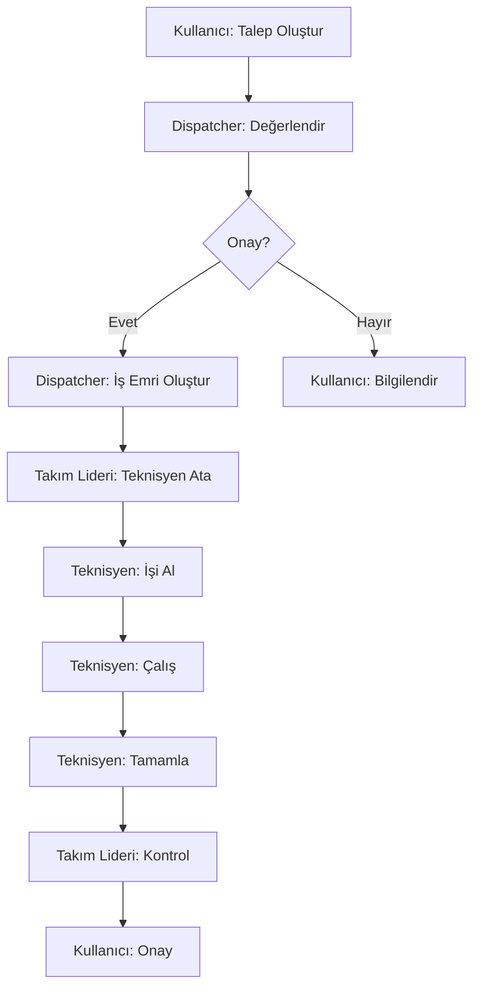

# Teknik Talep Yönetimi - Menü Yapısı ve Yetkilendirme Planı

## 📋 Özet
Bu doküman, tüm teknik servis fonksiyonlarını tek çatı altında toplayacak "Teknik Talep Yönetimi" modülünün menü yapısını ve yetkilendirme sistemini planlamak için oluşturulmuştur.

## 🏗️ Modül Mimarisi - Security Layer Pattern (ÖNERİLEN)

### ✅ Seçilen Yaklaşım: İki Katmanlı Modül Yapısı

#### 1️⃣ **technical_service** (Core Business Logic Module)
**Sorumlulukları:**
- ✓ Tüm model tanımlamaları (fields, methods, computations)
- ✓ Business logic ve iş kuralları
- ✓ Temel CRUD view'ları
- ✓ Workflow ve state yönetimi
- ✓ Raporlama altyapısı
- ✓ API ve integrations
- ✓ Data migrations

**Bu modülde OLMAYACAK:**
- ✗ Karmaşık menü yapıları
- ✗ Rol bazlı erişim kuralları
- ✗ Özelleştirilmiş dashboard'lar

#### 2️⃣ **technical_request_management** (Security & Access Layer Module)
**Sorumlulukları:**
- ✓ Tüm security groups tanımlamaları
- ✓ Record rules (domain filtreleri)
- ✓ Menü yapısı ve hiyerarşi
- ✓ Rol bazlı dashboard'lar
- ✓ Özelleştirilmiş list/form view'lar (inherit)
- ✓ Field-level access control
- ✓ Teknik organizasyon yönetimi

**Bu modülde OLMAYACAK:**
- ✗ Yeni model tanımlamaları (sadece inherit)
- ✗ Yeni field'lar (core module'e eklenir)
- ✗ Business logic değişiklikleri

### 🎯 Bu Yaklaşımın Avantajları

1. **Separation of Concerns**: Business logic ile access control ayrı
2. **Modülerlik**: Security layer isteğe bağlı kurulabilir
3. **Bakım Kolaylığı**: Her modülün net sorumlulukları var
4. **Test Edilebilirlik**: Business logic bağımsız test edilebilir
5. **Esneklik**: Farklı kurumlar farklı security layer kullanabilir
6. **Migration Yok**: Data taşıma gerekmez

### 📝 Örnek Kod Yapısı

**technical_service/models/maintenance_request.py:**
```python
class MaintenanceRequest(models.Model):
    _inherit = 'maintenance.request'

    # Business fields
    x_priority_level = fields.Selection([...])
    x_sla_deadline = fields.Datetime(compute='_compute_sla')

    # Business logic
    def action_assign_technician(self):
        # Core assignment logic
        pass
```

**technical_request_management/models/maintenance_request.py:**
```python
class MaintenanceRequestAccess(models.Model):
    _inherit = 'maintenance.request'

    # Sadece access control için override
    @api.model
    def search(self, args, offset=0, limit=None, order=None, count=False):
        # Role-based filtering logic
        user = self.env.user
        if user.has_group('technical_request_management.group_technician'):
            args += [('technician_user_id', '=', user.id)]
        return super().search(args, offset, limit, order, count)
```

### 🔗 Modül Bağımlılıkları

```python
# technical_service/__manifest__.py
{
    'name': 'Technical Service Core',
    'depends': ['maintenance', 'hr', 'stock'],
    # Core business functionality
}

# technical_request_management/__manifest__.py
{
    'name': 'Technical Request Management',
    'depends': ['technical_service'],  # Core module'e bağımlı
    # Security and menu layer
}
```

### ✨ Odoo'da Benzer Örnekler

Bu pattern Odoo'nun kendi modüllerinde de kullanılır:
- **sale** (core) → **sale_management** (menus/access)
- **account** (core) → **account_accountant** (full access)
- **stock** (core) → **stock_account** (accounting integration)
- **hr** (core) → **hr_attendance**, **hr_holidays** (specific features)

## 👥 Görev Tanımları (Roller)

Teknik talep yönetiminde **9 farklı görev tanımı** belirledik:

### 1. 👤 **Standart Kullanıcı (Standard User)**
- **Temel Görev**: Talep oluşturan son kullanıcı
- **Kod**: `tech_request.group_user`
- **Yetkiler**:
  - Talep oluşturma
  - Kendi taleplerini görüntüleme
  - Talep durumunu takip etme
  - Yorum ekleme

### 2. 📞 **Dispatcher - Talep Yöneticisi**
- **Temel Görev**: Gelen talepleri yönlendiren, ilk değerlendirmeyi yapan kişi
- **Kod**: `tech_request.group_dispatcher`
- **Yetkiler**:
  - Tüm talepleri görüntüleme
  - Talep atama ve yönlendirme
  - Öncelik belirleme
  - Kategori düzenleme
  - İş emri oluşturma

### 3. 🔧 **Teknisyen (Technician)**
- **Temel Görev**: Sahada çalışan, işleri çözen personel
- **Kod**: `tech_request.group_technician`
- **Yetkiler**:
  - Kendisine atanan işleri görüntüleme
  - İş durumu güncelleme
  - Çalışma kayıtları girişi
  - Malzeme kullanımı
  - Fotoğraf/belge ekleme

### 4. 👷 **Takım Lideri (Team Leader)**
- **Temel Görev**: Teknisyen ekibini yöneten kişi
- **Kod**: `tech_request.group_team_leader`
- **Yetkiler**:
  - Ekibinin tüm işlerini görüntüleme
  - İş emri oluşturma
  - İş atama ve yeniden atama
  - Ekip performans takibi
  - Vardiya planlaması

### 5. 🏭 **Birim Yöneticisi (Department Manager)**
- **Temel Görev**: Bilgi İşlem, Teknik Servis, Housekeeping gibi birimleri yöneten kişi
- **Kod**: `tech_request.group_department_manager`
- **Yetkiler**:
  - Birimi altındaki tüm takımları yönetme
  - Kaynak planlaması
  - Birim bazlı raporlar
  - SLA yönetimi

### 6. 🏢 **Kampüs/Bina Yöneticisi (Campus/Building Manager)**
- **Temel Görev**: Belirli lokasyonlardan sorumlu yönetici
- **Kod**: `tech_request.group_location_manager`
- **Yetkiler**:
  - Lokasyon bazlı tüm talepleri görüntüleme
  - Periyodik bakım planlaması
  - Lokasyon bazlı raporlar

### 7. 📦 **Demirbaş/Envanter Yöneticisi (Inventory Manager)**
- **Temel Görev**: Malzeme ve demirbaş yönetimi
- **Kod**: `tech_request.group_inventory_manager`
- **Yetkiler**:
  - Envanter yönetimi
  - Malzeme talepleri onaylama
  - Stok raporları
  - Demirbaş takibi

### 8. 🔑 **Sistem Yöneticisi (System Administrator)**
- **Temel Görev**: Tüm sistem ayarları ve yönetimi
- **Kod**: `tech_request.group_admin`
- **Yetkiler**:
  - Tüm fonksiyonlara tam erişim
  - Sistem ayarları
  - Kullanıcı yönetimi
  - Tüm raporlar

### 9. 📊 **Raporlama Yetkilisi (Reporting Officer)**
- **Temel Görev**: Sadece raporlama ve analiz
- **Kod**: `tech_request.group_reporting`
- **Yetkiler**:
  - Tüm raporlara erişim (salt okunur)
  - Dashboard görüntüleme
  - Veri dışa aktarma
  - Analitik görünümler

## 🎯 Odoo Best Practices - Yetkilendirme Yapısı

### 1. Security Groups Hiyerarşisi
```python
# groups.xml yapısı
- tech_request.group_user (Base group - herkes)
  ├── tech_request.group_technician
  ├── tech_request.group_dispatcher
  ├── tech_request.group_reporting
  └── tech_request.group_team_leader
      └── tech_request.group_department_manager
          └── tech_request.group_admin

# Paralel gruplar (inherit etmez)
- tech_request.group_location_manager
- tech_request.group_inventory_manager
```

### 2. Record Rules (Kayıt Kuralları)
```python
# Örnek: Teknisyen sadece kendi işlerini görür
<record id="rule_technician_own_tasks" model="ir.rule">
    <field name="name">Technician: Own Tasks Only</field>
    <field name="model_id" ref="model_maintenance_request"/>
    <field name="domain_force">[('technician_user_id', '=', user.id)]</field>
    <field name="groups" eval="[(4, ref('tech_request.group_technician'))]"/>
</record>
```

### 3. Field-Level Security
```xml
<!-- Form view'da rol bazlı field görünürlüğü -->
<field name="priority" groups="tech_request.group_dispatcher,tech_request.group_admin"/>
<field name="cost" groups="tech_request.group_admin" readonly="1"/>
<field name="internal_notes" groups="!tech_request.group_user"/>
```

## 📂 DETAYLI MENÜ YAPISI - TÜM ROLLER

### 🔵 1. STANDART KULLANICI
```
Teknik Talep Yönetimi/
├── 🏠 Dashboard (Kullanıcı Paneli)
├── 📝 Servis Talepleri/
│   ├── Yeni Talep Oluştur
│   └── Taleplerim (domain: create_uid = user.id)
└── 📊 Raporlar/
    └── Talep Geçmişim
```

### 🟢 2. DISPATCHER - TALEP YÖNETİCİSİ
```
Teknik Talep Yönetimi/
├── 🏠 Dashboard (Dispatcher Paneli)
├── 📝 Servis Talepleri/
│   ├── Arıza Bildirimleri/
│   │   ├── 🔴 Acil Talepler (priority = '3')
│   │   ├── 🆕 Yeni Talepler (state = 'new')
│   │   ├── ⏳ Bekleyen Talepler (state = 'waiting')
│   │   ├── 📋 Atama Bekleyenler (technician_id = False)
│   │   └── 📚 Tüm Talepler
│   └── İş Emirleri/
│       ├── 🚫 Atanmamış İşler (technician_id = False)
│       ├── 🔄 Devam Eden İşler (state = 'in_progress')
│       ├── 📅 Bugünkü İşler (schedule_date = today)
│       └── 📋 Tüm İş Emirleri
├── 👥 Ekip Yönetimi/
│   ├── Teknisyen Durumları
│   └── Vardiya Planı
└── 📊 Raporlar/
    ├── Günlük Özet
    └── Atama Raporu
```

### 🟡 3. TEKNİSYEN
```
Teknik Talep Yönetimi/
├── 🏠 Dashboard (Teknisyen Paneli)
├── 📝 Servis Talepleri/
│   └── İş Emirleri/
│       ├── ⚡ Acil İşlerim (priority = '3' AND technician_user_id = user.id)
│       ├── 👤 Benim İşlerim (technician_user_id = user.id)
│       ├── 📅 Bugünkü İşlerim (schedule_date = today)
│       ├── 🔄 Devam Eden İşlerim (state = 'in_progress')
│       └── ✅ Tamamlanan İşlerim (state = 'done')
├── 🔧 İş Takibi/
│   ├── Zaman Kaydı
│   └── Malzeme Kullanımı
└── 📊 Raporlar/
    └── Performansım
```

### 🟠 4. TAKIM LİDERİ
```
Teknik Talep Yönetimi/
├── 🏠 Dashboard (Takım Lideri Paneli)
├── 📝 Servis Talepleri/
│   ├── Arıza Bildirimleri/
│   │   ├── 🔴 Acil Talepler (team_id = user.team_id AND priority = '3')
│   │   └── 👥 Ekibimin Talepleri (team_id = user.team_id)
│   └── İş Emirleri/
│       ├── ➕ İş Emri Oluştur
│       ├── 👥 Ekip İşleri (team_id = user.team_id)
│       ├── 📋 İş Ataması Yap
│       ├── 🔄 Devam Eden İşler
│       └── 📊 Performans Özeti
├── 👥 Ekip Yönetimi/
│   ├── Ekip Üyeleri
│   ├── Vardiya Planlaması
│   ├── İzin Takibi
│   └── Eğitim Planı
├── 📦 Kaynak Yönetimi/
│   └── Malzeme Talepleri
└── 📊 Raporlar/
    ├── Ekip Performansı
    ├── SLA Takibi
    └── Verimlilik Analizi
```

### 🔴 5. BİRİM YÖNETİCİSİ
```
Teknik Talep Yönetimi/
├── 🏠 Dashboard (Birim Yöneticisi Paneli)
├── 📝 Servis Talepleri/
│   ├── Arıza Bildirimleri/
│   │   ├── 🔴 Kritik Talepler (priority = '3')
│   │   ├── 🏭 Birim Talepleri (department_id = user.department_id)
│   │   └── ⚠️ SLA Risk Analizi
│   └── İş Emirleri/
│       ├── 🏭 Birim İşleri
│       ├── 📊 SLA Takibi
│       └── 📈 Kaynak Planlaması
├── 👥 Ekip Yönetimi/
│   ├── Takım Liderleri
│   ├── Kapasite Planlaması
│   └── Performans Değerlendirme
├── 🎯 Planlama/
│   ├── Stratejik Planlama
│   ├── Bütçe Yönetimi
│   └── Yıllık Bakım Planı
├── 📦 Kaynak Yönetimi/
│   ├── Envanter Durumu
│   └── Satınalma Talepleri
└── 📊 Raporlar/
    ├── Birim Performansı
    ├── KPI Dashboard
    ├── Maliyet Analizi
    └── Trend Analizi
```

### 🏢 6. KAMPÜS/BİNA YÖNETİCİSİ
```
Teknik Talep Yönetimi/
├── 🏠 Dashboard (Lokasyon Paneli)
├── 📝 Servis Talepleri/
│   ├── 🏢 Lokasyon Talepleri (location_id in user.location_ids)
│   ├── ➕ Toplu Talep Oluştur
│   └── 📅 Periyodik Bakımlar
├── 🏗️ Lokasyon Yönetimi/
│   ├── Bina Bilgileri
│   ├── Kat Planları
│   ├── Ekipman Listesi
│   └── Kritik Noktalar
├── 📅 Planlama/
│   ├── Periyodik Bakım Takvimi
│   ├── Renovasyon Planı
│   └── Acil Durum Planı
├── 📦 Envanter/
│   └── Lokasyon Envanteri
└── 📊 Raporlar/
    ├── Lokasyon Performansı
    ├── Arıza Analizi
    └── Maliyet Raporu
```

### 📦 7. DEMİRBAŞ/ENVANTER YÖNETİCİSİ
```
Teknik Talep Yönetimi/
├── 🏠 Dashboard (Envanter Paneli)
├── 📦 Envanter Yönetimi/
│   ├── Demirbaş Listesi
│   ├── Stok Durumu
│   ├── Malzeme Hareketleri
│   ├── Kritik Stok Uyarıları
│   └── Sayım İşlemleri
├── 🛒 Satınalma/
│   ├── Talep Onayları
│   ├── Sipariş Takibi
│   └── Tedarikçi Yönetimi
├── 🔧 Bakım Malzemeleri/
│   ├── Malzeme Talepleri
│   ├── Kullanım Onayları
│   └── İade İşlemleri
├── 📋 Demirbaş Takibi/
│   ├── Zimmet İşlemleri
│   ├── Transfer İşlemleri
│   └── Hurda İşlemleri
└── 📊 Raporlar/
    ├── Stok Raporu
    ├── Maliyet Analizi
    ├── Kullanım Raporu
    └── ABC Analizi
```

### 🔑 8. SİSTEM YÖNETİCİSİ
```
Teknik Talep Yönetimi/
├── 🏠 Dashboard (Admin Paneli)
├── 📝 Servis Talepleri/
│   ├── Tüm Talepler (no domain)
│   └── İş Emirleri (no domain)
├── 👥 Kullanıcı Yönetimi/
│   ├── Kullanıcılar
│   ├── Rol Atamaları
│   ├── Yetki Grupları
│   └── Erişim Logları
├── ⚙️ Sistem Ayarları/
│   ├── Genel Ayarlar
│   ├── SLA Tanımları
│   ├── Kategori Yönetimi
│   ├── Öncelik Seviyeleri
│   ├── Durum Tanımları
│   └── E-posta Şablonları
├── 🏗️ Master Data/
│   ├── Lokasyonlar
│   ├── Ekipmanlar
│   ├── Takımlar
│   ├── Birimler
│   └── Vardiyalar
├── 🔄 Entegrasyonlar/
│   ├── API Ayarları
│   ├── Webhook Yönetimi
│   └── Harici Sistemler
├── 📊 Raporlar/
│   ├── Sistem Raporu
│   ├── Audit Log
│   ├── Performans Metrikleri
│   └── Tüm Raporlar
└── 🛠️ Bakım/
    ├── Veri Temizleme
    ├── Arşivleme
    └── Sistem Sağlığı
```

### 📊 9. RAPORLAMA YETKİLİSİ
```
Teknik Talep Yönetimi/
├── 🏠 Dashboard (Analitik Panel)
├── 📊 Operasyonel Raporlar/
│   ├── Günlük Raporlar
│   ├── Haftalık Özet
│   ├── Aylık Performans
│   └── Yıllık Analiz
├── 📈 Performans Raporları/
│   ├── Teknisyen Performansı
│   ├── Takım Performansı
│   ├── Birim Performansı
│   └── SLA Uyum Raporu
├── 💰 Maliyet Analizleri/
│   ├── İşçilik Maliyetleri
│   ├── Malzeme Maliyetleri
│   ├── Toplam Maliyet
│   └── ROI Analizi
├── 📉 Trend Analizleri/
│   ├── Arıza Trendleri
│   ├── Kategori Analizi
│   ├── Lokasyon Analizi
│   └── Mevsimsel Analiz
├── 🎯 KPI Dashboard/
│   ├── MTTR (Mean Time to Repair)
│   ├── MTBF (Mean Time Between Failures)
│   ├── First Call Resolution
│   └── Customer Satisfaction
└── 📤 Dışa Aktarım/
    ├── Excel Export
    ├── PDF Raporlar
    └── Zamanlanmış Raporlar
```

## 🏗️ TEKNİK ORGANİZASYON YAPISI

### Detaylı Model Tanımı

```python
class TechnicalOrganization(models.Model):
    """Teknik servis organizasyon yapısı - HR'dan bağımsız"""
    _name = 'tech_request.organization'
    _description = 'Technical Service Organization'
    _rec_name = 'display_name'
    _inherit = ['mail.thread', 'mail.activity.mixin']

    # Temel Bilgiler
    employee_id = fields.Many2one('hr.employee', required=True, string='Employee')
    user_id = fields.Many2one('res.users', related='employee_id.user_id', store=True)
    display_name = fields.Char(compute='_compute_display_name', store=True)
    active = fields.Boolean(default=True)

    # Rol ve Yetki
    role = fields.Selection([
        ('user', 'Standard User'),
        ('technician', 'Technician'),
        ('dispatcher', 'Dispatcher'),
        ('team_leader', 'Team Leader'),
        ('department_manager', 'Department Manager'),
        ('location_manager', 'Location Manager'),
        ('inventory_manager', 'Inventory Manager'),
        ('admin', 'System Administrator'),
        ('reporting', 'Reporting Officer')
    ], required=True, tracking=True)

    # Organizasyon Bilgileri
    department_id = fields.Many2one('tech_request.department', string='Department')
    team_id = fields.Many2one('maintenance.team', string='Team')
    location_ids = fields.Many2many('technical_service.location', string='Responsible Locations')

    # Yetkinlikler
    skill_ids = fields.Many2many('tech_request.skill', string='Skills')
    skill_level = fields.Selection([
        ('junior', 'Junior'),
        ('mid', 'Mid-Level'),
        ('senior', 'Senior'),
        ('expert', 'Expert')
    ], string='Skill Level')

    # Vardiya ve Müsaitlik
    shift_id = fields.Many2one('tech_request.shift', string='Default Shift')
    availability_status = fields.Selection([
        ('available', 'Available'),
        ('busy', 'Busy'),
        ('off_duty', 'Off Duty'),
        ('on_leave', 'On Leave')
    ], default='available', string='Current Status')

    # Performans
    rating = fields.Float(string='Rating', compute='_compute_rating')
    completed_tasks = fields.Integer(compute='_compute_statistics')
    avg_resolution_time = fields.Float(compute='_compute_statistics')

    @api.depends('employee_id', 'role')
    def _compute_display_name(self):
        for record in self:
            role_name = dict(self._fields['role'].selection).get(record.role, '')
            record.display_name = f"{record.employee_id.name} - {role_name}"

    @api.onchange('role')
    def _onchange_role(self):
        """Role değiştiğinde otomatik grup ataması"""
        if self.user_id and self.role:
            # Eski grupları temizle
            self._remove_all_tech_groups()

            # Yeni grup ata
            group_mapping = {
                'user': 'tech_request.group_user',
                'technician': 'tech_request.group_technician',
                'dispatcher': 'tech_request.group_dispatcher',
                'team_leader': 'tech_request.group_team_leader',
                'department_manager': 'tech_request.group_department_manager',
                'location_manager': 'tech_request.group_location_manager',
                'inventory_manager': 'tech_request.group_inventory_manager',
                'admin': 'tech_request.group_admin',
                'reporting': 'tech_request.group_reporting'
            }

            group_ref = group_mapping.get(self.role)
            if group_ref:
                group = self.env.ref(group_ref)
                self.user_id.groups_id = [(4, group.id)]
```

### 🎯 DASHBOARD TASARIMLARI

#### 1. Teknisyen Dashboard'u
```python
# Dashboard widget'ları
- Bugünkü İşlerim (Kanban cards)
- Acil İşler (Alert banner)
- Haftalık Performansım (Progress bar)
- Son Tamamladıklarım (List)
```

#### 2. Dispatcher Dashboard'u
```python
# Dashboard widget'ları
- Bekleyen Atamalar (Counter + List)
- Teknisyen Durumları (Team availability matrix)
- SLA Risk Uyarıları (Alert cards)
- Canlı İş Akışı (Activity stream)
```

#### 3. Yönetici Dashboard'u
```python
# Dashboard widget'ları
- KPI Göstergeleri (Gauge charts)
- Trend Grafikleri (Line charts)
- Ekip Performansı (Bar charts)
- Kritik Uyarılar (Alert panel)
```

## 🔄 İŞ AKIŞI VE ROLLER ARASI ETKİLEŞİM

### Talep Yaşam Döngüsü



### Yetki Matrisi

| İşlem | User | Tech | Disp | Team | Dept | Loc | Inv | Admin | Report |
|-------|------|------|------|------|------|-----|-----|-------|--------|
| Talep Oluştur | ✅ | ✅ | ✅ | ✅ | ✅ | ✅ | ❌ | ✅ | ❌ |
| Talep Ata | ❌ | ❌ | ✅ | ✅ | ✅ | ❌ | ❌ | ✅ | ❌ |
| İş Yap | ❌ | ✅ | ❌ | ✅ | ❌ | ❌ | ❌ | ✅ | ❌ |
| Rapor Gör | 🔒 | 🔒 | ✅ | ✅ | ✅ | 🔒 | 🔒 | ✅ | ✅ |
| Ayar Değiştir | ❌ | ❌ | ❌ | ❌ | 🔒 | ❌ | ❌ | ✅ | ❌ |

*🔒 = Kısıtlı erişim (sadece kendi verileri)*

## 📦 MODÜL YAPILANDIRMASI

### technical_request_management Klasör Yapısı
```
technical_request_management/
├── __manifest__.py
├── security/
│   ├── security_groups.xml       # 9 rol tanımı
│   ├── ir.model.access.csv      # Model erişimleri
│   └── record_rules.xml         # Domain filtreleri
├── data/
│   ├── default_roles.xml        # Varsayılan roller
│   └── menu_structure.xml       # Ana menü yapısı
├── views/
│   ├── menu_views.xml           # Rol bazlı menüler
│   ├── dashboard_views.xml      # Dashboard'lar
│   └── inherited_views.xml      # Field-level security
├── models/
│   ├── __init__.py
│   ├── technical_organization.py # Teknik org modeli
│   └── access_control.py        # Erişim kontrol override'ları
└── wizard/
    └── role_assignment_wizard.py # Toplu rol atama

```

## 🚀 İMPLEMENTASYON YOL HARİTASI

### FAZA 1: Temel Altyapı (1. Hafta)
```
✅ technical_service modülü güncelleme
├── Eksik field'lar ekleme
├── Model ilişkileri düzenleme
└── Temel view'lar hazırlama

✅ technical_request_management modülü oluşturma
├── Modül iskeletini kurma
├── Manifest dosyası
└── Klasör yapısı
```

### FAZA 2: Security Layer (2. Hafta)
```
🔐 Güvenlik Altyapısı
├── 9 security group tanımlama
├── Model access rights (CSV)
├── Record rules yazma
└── Field-level security
```

### FAZA 3: Organizasyon Modeli (3. Hafta)
```
👥 Teknik Organizasyon
├── Organization model oluşturma
├── Role assignment wizard
├── HR entegrasyonu
└── Otomatik grup ataması
```

### FAZA 4: Menü Yapısı (4. Hafta)
```
📂 Menü Hiyerarşisi
├── Ana menü yapısı
├── Rol bazlı alt menüler
├── Domain filtreleri
└── Action'lar ve context'ler
```

### FAZA 5: Dashboard'lar (5. Hafta)
```
📊 Dashboard Geliştirme
├── Teknisyen dashboard'u
├── Dispatcher dashboard'u
├── Yönetici dashboard'ları
└── KPI widget'ları
```

### FAZA 6: Test ve Optimizasyon (6. Hafta)
```
🧪 Test ve İyileştirme
├── Rol bazlı test senaryoları
├── Performans optimizasyonu
├── Bug fixing
└── Kullanıcı geri bildirimleri
```

## 📋 DETAYLI İMPLEMENTASYON KONTROL LİSTESİ

### ✅ Core Module (technical_service)
- [ ] `technician_user_id` field'ını maintenance.request'e ekle
- [ ] `x_department_id` field'ını ekle
- [ ] `x_sla_deadline` computed field ekle
- [ ] State workflow'unu güncelle
- [ ] Temel raporlama view'ları oluştur

### 🔐 Security Module (technical_request_management)

#### Security Groups
- [ ] `tech_request.group_user` - Standart Kullanıcı
- [ ] `tech_request.group_technician` - Teknisyen
- [ ] `tech_request.group_dispatcher` - Dispatcher
- [ ] `tech_request.group_team_leader` - Takım Lideri
- [ ] `tech_request.group_department_manager` - Birim Yöneticisi
- [ ] `tech_request.group_location_manager` - Kampüs/Bina Yöneticisi
- [ ] `tech_request.group_inventory_manager` - Envanter Yöneticisi
- [ ] `tech_request.group_admin` - Sistem Yöneticisi
- [ ] `tech_request.group_reporting` - Raporlama Yetkilisi

#### Record Rules
- [ ] Teknisyen: Sadece kendi işleri
- [ ] Takım Lideri: Takım işleri
- [ ] Birim Yöneticisi: Birim işleri
- [ ] Lokasyon Yöneticisi: Lokasyon bazlı
- [ ] Standart Kullanıcı: Kendi talepleri

#### Menü Görünürlüğü
- [ ] Her rol için menü filtreleme
- [ ] Dashboard erişimleri
- [ ] Rapor erişimleri
- [ ] Ayar menüsü kısıtlamaları

### 👥 Organization Model
- [ ] `tech_request.organization` modeli
- [ ] `tech_request.department` modeli
- [ ] `tech_request.skill` modeli
- [ ] `tech_request.shift` modeli
- [ ] Role assignment wizard

### 📊 Dashboard Components
- [ ] Teknisyen: İş kartları widget'ı
- [ ] Dispatcher: Atama matrisi
- [ ] Yönetici: KPI gauge'ları
- [ ] Raporlama: Analitik grafikler

### 🧪 Test Senaryoları
- [ ] Her rol için login testi
- [ ] Menü görünürlük testi
- [ ] Data filtreleme testi
- [ ] Field erişim testi
- [ ] Workflow testi

## 🎯 BAŞARI KRİTERLERİ

1. **Güvenlik**: Her kullanıcı sadece yetkili olduğu verileri görmeli
2. **Kullanılabilirlik**: Menüler rol bazlı mantıklı organize edilmeli
3. **Performans**: Dashboard'lar 2 saniyeden kısa sürede yüklenmeli
4. **Esneklik**: Yeni roller kolayca eklenebilmeli
5. **Bakım**: Kod modüler ve sürdürülebilir olmalı

## 📝 NOTLAR VE ÖNERİLER

### Kritik Noktalar
- ⚠️ HR modülü bağımlılığı dikkatli yönetilmeli
- ⚠️ Performance için record rule'lar optimize edilmeli
- ⚠️ Dashboard query'leri cached olmalı

### Best Practices
- ✅ Her değişiklik için migration script yazılmalı
- ✅ Security test otomasyonu kurulmalı
- ✅ Dokümantasyon sürekli güncellenmeli

### Gelecek Geliştirmeler
- 📱 Mobile responsive dashboard'lar
- 🤖 AI-based iş atama önerileri
- 📊 Advanced analytics module
- 🔗 IoT sensör entegrasyonu

---

*Doküman Durumu: PLANLAMA TAMAMLANDI ✅*
*Son Güncelleme: Detaylı menü yapısı, organizasyon modeli ve yol haritası eklendi*
*Sonraki Adım: Onay alınıp implementasyona başlanacak*